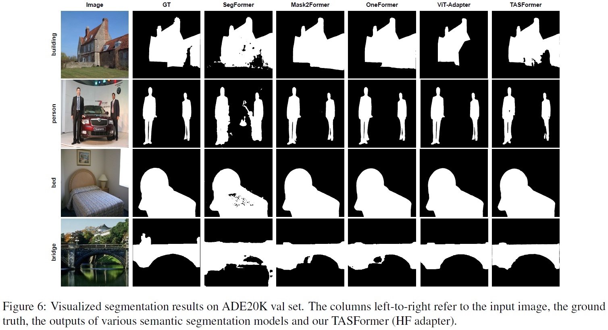

# TASFormer: Task-aware Image Segmentation Transformer

  

[[`arXiv`]()] [[`pdf`]()] [[`BibTeX`]()]

This repo contains the code for our paper **TASFormer: Task-aware Image Segmentation Transformer**.

## Contents

2. [Notes](#notes)
3. [Installation Instructions](#installation-instructions)
4. [Dataset Preparation](#dataset-preparation)
5. [Execution Instructions](#execution-instructions)
    - [Training](#training)
    - [Evaluation](#evaluation)
6. [Results](#results)

## Notes

[ADE20K_multitask_segmentation/](ADE20K_multitask_segmentation/) contains codes and configs for ADE20K dataset.

[multitask_segmentation/](multitask_segmentation/) contains additional codes and configs for GDD, Sun, SceneNet and Trans10k datasets.

[transformers_update_for_adapters/](transformers_update_for_adapters/) contains files required for `TASFormer (HF adapter)` and `TASFormer (HF adapter++)`.

You can find $bIoU$ metric implementation inside `validation_step()` in [pl_module.py](ADE20K_multitask_segmentation/seg_training/pl_module.py). Keep in mind, our TASFormer model works with binary masks, and averaging is performed over all masks, regardless of their class. More details about $bIoU$ metric can be found in our [Paper](). 

## Installation Instructions

- We use Python 3.8, PyTorch 1.8.1 (CUDA 10.1 build).
- We use PyTorch Lightning 1.5.0.
- For complete installation instructions, please see [Installation](INSTALL.md).

## Dataset Preparation

- We experiment on ADE20K benchmark and other datasets.
- Please see [Preparing Datasets](DATASET_PREPARATION.md) for complete instructions for preparing the datasets.

## Execution Instructions

### Training

- Please see [Getting Started](GETTING_STARTED.md) for training commands.

### Evaluation

- Please see [Getting Started](GETTING_STARTED.md) for evaluation commands.

## Results

You can find our pretrained models in [Getting Started](GETTING_STARTED.md).

### ADE20K

Segmentation results on different `Num Classes` from ADE20K dataset, $bIoU$, %.

| Method | Params | Crop Size | 2 | 12 | 150 |
|   :---:|  :---:           | :---:               | :---:   |  :---: |    :---:   |
| SegFormer (B0) | 3.8M | 320&times;320 | 63.2 | 52.4 | 37.9 |
| TASFormer (emb) | 4--14M | 320&times;320 | 60.8 | 6.1 | 14.1 |
| TASFormer (VSA emb) | 4.1M | 320&times;320 | 48.6 | 0.1 | 0.1 |
| TASFormer (HF adapter) | 7.3M | 320&times;320 | **67.9** | **59.4** | **48.3** |
| TASFormer (HF adapter++) | 5.7M | 320&times;320 | **67.9** | 58.4 | 47.6 |

  

Segmentation results of TASFormer (HF adapter) with different `Crop Size` on ADE20K dataset, $bIoU$, %.

| Method | Params | Crop Size | $mIoU$, % | $bIoU$, % |
|   :---:| :---:   |  :---: |    :---:   |    :---:   |
| TASFormer (HF adapter) | 7.3M | 320&times;320 | 14.6 | 48.3 |
| TASFormer (HF adapter) | 7.3M | 640&times;640 | 14.7 | 51.1 |
| TASFormer (HF adapter) | 7.3M | 896&times;896 | 14.4 | **52.0** |
